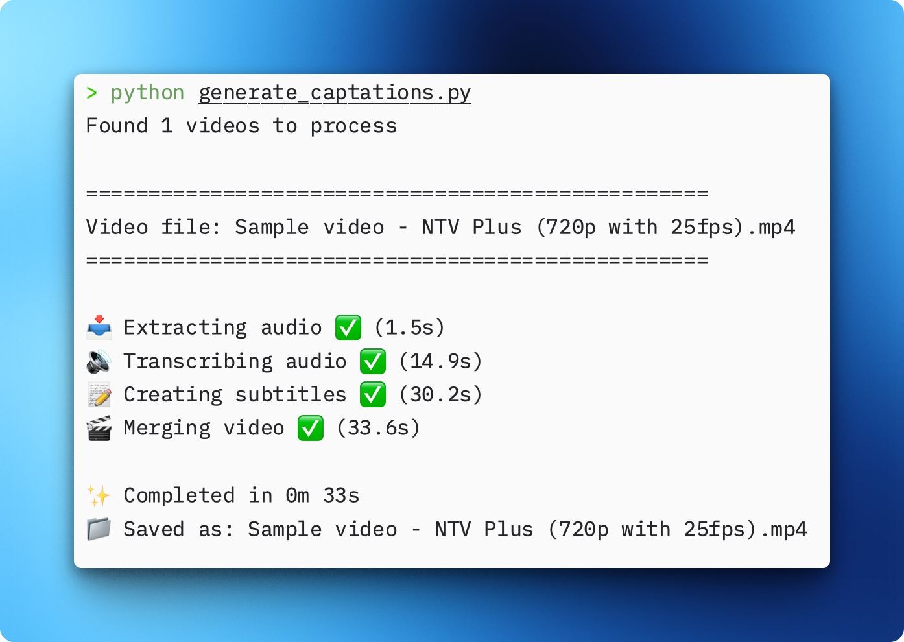

# Generate English Captations from Vimeo video

Simple script that inputs 2 `mp4` videos (audio, video) in *any language* and outputs a single video with english generated subtitles.



## Project Overview

`generate_captations.py` script:

1. Processes videos from a local `videos` directory
2. Skips if a video is found in `videos_translated` directory
2. Extracts audio from each video
3. Transcribes and translates most languages audio to English text using [faster-whisper python package](https://github.com/SYSTRAN/faster-whisper?tab=readme-ov-file)
4. Creates SRT subtitle files with proper timing
5. Embeds English subtitles into the original videos
6. Saves translated video to a `videos_translated` directory


## Installation

```bash
# Clone the repository
git clone https://github.com/pipegalera/video-translator.git
cd video-translator

# Install dependencies
pip install -f requirements.txt

# Install FFmpeg if not already installed
# Ubuntu/Debian:
# sudo apt update && sudo apt install ffmpeg

# macOS:
# brew install ffmpeg

# Windows:
# Download from https://www.ffmpeg.org/download.html
```

## Usage

1. Download any video and audio in Vimeo using Chrome extension [Free Vimeo™ Downloader](https://chromewebstore.google.com/detail/free-vimeo-downloader/migiikaijhclkmlpnnfficpopgmcpgia?hl=enq)

2. Download the script (see `Installation`)

3. Place the 2 Vimeo `mp4` files under `videos` folder
   
4.  run `python generate_captations`
